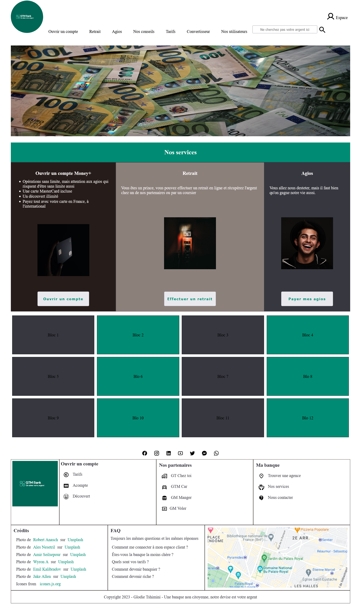

# Exercice 5

---

## Modalités

- Créez l'application Vue avec `npm init vue@latest`

---

## Enoncé

1. Récupérez les fichiers sources du template [GTM Bank](./ressources/gtm-bank.zip)
2. Créez un nouveau projet Vue.
3. Refactorisez le template en application vue en isolant les différentes parties du site dans des composants potentiellement réutilisables.
PS: pour le moment, il n'est pas demandé d'assembler le tout, mais juste de faire du découpage, l'assemblage fera l'objet du prochain exercice.
4. Refactorisez avec des slots

PS: Faire un découpage grossier au départ puis affiner petit à petit pour avoir les composants les plus pétites possibles.
Ne perdez pas de temps avec le CSS, si la mise en page est dégradé à cause des règles CSS beaucoup plus spécifiques, ce n'est pas grave.

---

## Template

