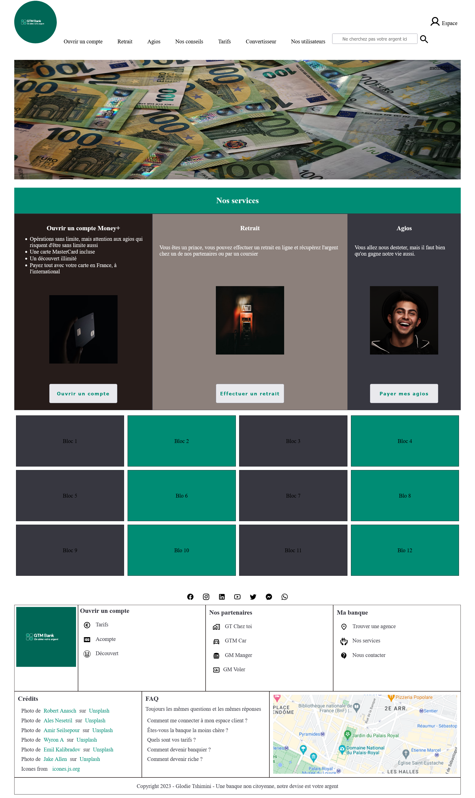

# Exercice 6

---

## Enoncé

1. Reprenez l'exercice 5
2. Rassemblez tous les composants au niveau d'un composant parent.
- Le header et le footer sont statiques
- Entre le footer et le header, le contenu principal est dynamique
3. Rajoutez 2 nouvelles routes (pages)
- Le premier à intégrer dans le menu de navigation sous le nom de "convertisseur" ou un équivalent (qui ajoute le composant convertisseur vu dans l'exercice 4 et 4 bis)
- Le deuxième à intégrer également dans le menu de navigation sous le nom de 'nos utilisateurs'
4. Pour la page "nos utilisateurs":
- Utilisez l'[API de GitHub](https://api.github.com/users) pour récupérer les informations des utilisateurs de GitHub.
- Affichez une partie des informations sous forme de carte par exemple les cartes [Bootstrap](https://getbootstrap.com/docs/4.0/components/card/)
- Créez un lien vers une page de détails permettant d'avoir l'affichage plus détaillé des informations d'un utilisateur.

---

## Template

